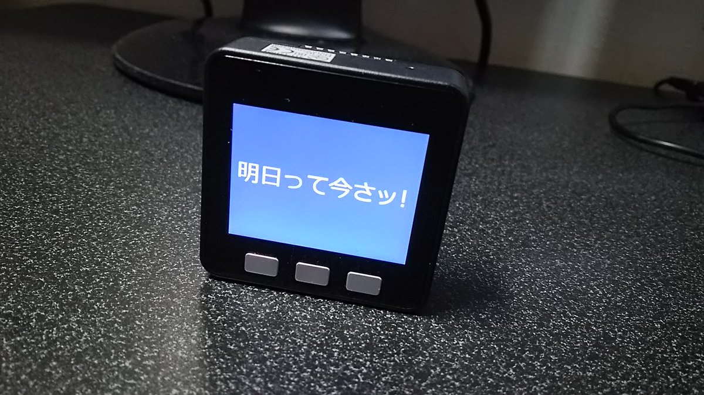

# About

This is from Bodmer/TFT_eSPI : https://github.com/Bodmer/TFT_eSPI

Modification to use many Japanese Smooth fonts on M5Stack. TFT_eSPI uses SPIFFS but SPIFFS does not have enough strage to express Japanese fonts. This library can uses SD card instead of SPIFFS. 

And font metrics data for Japanse fonts uses many RAM. So this library uses temporary file in SD card instead of RAM for them when using SD card. But this causes little slow down of drawing fonts.

An example is examples/M5Stack_Simple_Font.
Execute "Tools/Create_Smooth_Font/Create_font/Create_font.pde" by Processing to get font file(xxxx.vlw) for this library.

